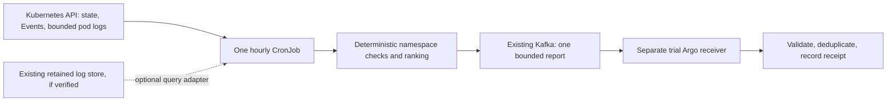

# Namespace health job: home-lab build plan

Prepared 7 October 2026. Revision 1, pending independent Opus and Kimi review.
The user requested plan → review → build and test → workplace replication.
This revision defines the proposed build; it is not implementation or live proof.

## 1. Outcome and smallest architecture

Answer: **Which watched namespaces have concrete evidence worth investigating,
and why?** Produce one bounded report per scheduled assessment containing up to
three qualifying namespaces. An empty assessment creates no investigation event.

One Kafka envelope contains the selected namespaces and evidence summaries.
This is a deliberate new contract, not three legacy pod incidents or a raw-log
feed. It produces at most one logical report per cluster/scheduled UTC hour;
transport retries may create duplicate Kafka records. A receiver suppresses
duplicate effects. This is not an exactly-once or strict daily-budget promise.

The first home-lab milestone ends at a real Argo receipt. Connecting the existing
read-only investigation is a subsequent gate; ticket writes and remediation
are outside this build. Existing collectors and routine routes remain intact
during the isolated trial. Production noise reduction requires a later scoped
replacement of the old routine trigger route.

## 2. Decisions and explicit tradeoffs

| Decision | Reason and consequence |
|---|---|
| One Python CronJob, direct Kafka publication | Reuses policy expertise and proven Python Kafka dependencies; no service, database, or forwarding sidecar. |
| Initial hourly schedule, configurable | Matches the previous hourly requirement. Detection can take one schedule interval plus runtime. Existing urgent paging stays independent. |
| Stateless worker | No HTTP ingest, PostgreSQL, PVC, or worker-side outbox. An outage can lose an assessment; the next run assesses fresh state. |
| Current state plus bounded recent evidence | Delivers useful namespace findings without inventing complete history. Short incidents between runs may be missed. |
| One report with up to three namespaces | Limits routine workflow input and payload size. Includes eligible/deferred totals; omission never means healthy. |
| Dedicated versioned topic/receiver in the trial | Existing v2 Sensors require individual incident fields and cannot safely accept the new report unchanged. |
| Receiver receipt state uses Kubernetes ConfigMaps | Provides atomic create-based receipt deduplication using the existing API, without a new database. Limited to an isolated receiver namespace. |
| Explainable risk score: higher means worse | Avoids confusion with the older assessor's high-is-healthy display score. Every score comes from a named rule. |

The design prioritizes periodic current-state convergence and a small operational
footprint. Lossless event history, guaranteed delivery through long outages,
exact daily Kafka quotas and autonomous incident lifecycle management would
require additional retained state and a separate design decision.

## 3. Source contract

Watch an explicit namespace allowlist. Initially use three isolated fixture
namespaces and no production applications. Read namespace identity, Pods,
Deployments, StatefulSets, DaemonSets, ReplicaSets, Jobs/CronJobs, PVCs and Events.
Resolve controller ownership from returned objects, not pod-name suffixes.
Namespace findings can include unresolved owners, marked as such; namespace
identity, not a guessed owner, is the report's correlation boundary.

Snapshot time and history window are separate fields. Read current workload
state at assessment time. Default recent-evidence window is the preceding hour.
Kubernetes API reads are not a transactionally consistent cluster snapshot;
include observation timestamps and assessment duration.

**Events:** use one Events API version, identify objects by UID, and select using
the latest valid series/last-observed timestamp. Do not sum cumulative Event
counts or describe a recently updated Event's lifetime count as hourly incidents.
Report recently observed Warning Event objects and their reasons; any cumulative
count is explicitly labelled. Events are supporting evidence with incomplete
historical coverage.

**Logs, initial adapter:** use timestamped Pod log reads with a fixed since-time,
tail/byte limits, explicit container selection and a fixed assessment end-time.
Discard outside-window lines and malformed partial lines. Select a bounded mix
of affected and apparently healthy workloads; rotate the latter deterministically
by slot so log-only failures are not permanently ignored. Count matched lines
only within inspected content. Never call sampled counts total namespace volume
or an error rate. Record inspected versus eligible containers, truncation and
read failures. Container restart/deletion and rotation can remove evidence.

**Existing retained store, optional:** if the live inventory proves a usable
Loki or equivalent endpoint, prefer bounded aggregate queries for whole-window
log counts, with label scope, source freshness, rate denominator and query cost
verified. Alloy's `loki.source.*` configuration does not prove a Loki database
exists. No new log store is installed merely to make this design work. An absent
backend means the initial pilot proves sampled log detection only.

Do not inherit the current Alloy rule that drops any line containing `info`:
such a line may also contain a real error. Do not duplicate continuous log
collection. Querying bounded evidence once per scheduled job is the only added
read path in the initial pilot.

## 4. Rules, ranking and coverage

These are provisional calibration defaults, not an established SRE standard:

| Rule | Risk score | Required evidence |
|---|---:|---|
| Declared critical workload has zero available replicas | 100 | Desired replicas > 0, current observed generation and continuous unavailability supported for at least five minutes. |
| Workload availability deficit or active CrashLoopBackOff | 90 | Current corroborating state and an explicit age/grace check; stale restart counters alone do not qualify. |
| Persistent unschedulable workload | 80 | Current unschedulable Pod state for at least ten minutes; recent matching Event when available. |
| Repeated application errors in inspected logs | 80 | At least 20 recognized application-error records spanning five minutes in the last hour; structured severity or an explicitly approved pattern, not generic substring matches. Counts are lower bounds when sampled. |
| Recent warning/OOM evidence without current impact | 60 | Recent typed evidence, reported as context rather than assumed ongoing failure. |

Namespace risk is the **maximum triggered rule score**, not a sum of repeated
lines, and qualification defaults to `risk_score >= 80`. Ranking is score, then
number of distinct affected workloads, then stable namespace identity. Supporting
counts explain the result without allowing sheer log volume to outrank impact.
Successful completed Jobs, scaled-to-zero workloads, expected rollout grace
and old terminated-container failures must not create active availability findings.
If a duration cannot be established from current evidence, do not invent it or
qualify that duration-based rule.

Record each source as complete-within-declared-scope, sampled, unavailable or
not-configured. An observed severe failure may qualify despite another missing
source. Missing data cannot yield a healthy verdict or a recovery event.
The job emits `investigate`, `no_breach_observed`, or `unknown` locally. Only
`investigate` produces a Kafka investigation report. Partial-source failures
remain operational failures even if valid positive findings are delivered.

Do not add two-observation persistence or automatic recovery to this first
stateless build. Temporal confirmation needs retained state. Repeated active
findings can recur in subsequent hourly reports; a future investigation gate
must suppress unchanged work over its agreed cooldown before model calls or
ticketing are enabled.

## 5. Report and receiver contract

New schema: `namespace-health.report.v1`, on a dedicated trial topic on the
existing broker. Required fields:

- trusted cluster identity and source generation; policy version;
- scheduled slot, assessment start/end, evidence window;
- deterministic `slot_id` from trusted cluster identity and scheduled UTC hour;
- canonical payload digest, `automation_allowed: false`, `action: investigate`;
- namespace UID/name, risk score, named findings, typed evidence counts and
  bounded workload references for up to three namespaces;
- watched/assessed/eligible/deferred namespace totals, source coverage,
  truncation flags and failed-check counts.

Maximum encoded JSON value: **8 KiB**. Maximum three findings per selected
namespace and three workload references per finding. Prefer rule-generated
descriptions and resource references; raw log lines/Event messages stay out of
Kafka. Field lengths and overall bytes are enforced before publication. Validate
the same schema in producer and receiver. Do not fabricate legacy pod fields
to pass this through an existing `observability.triage.v2` Sensor.

The scheduled slot is obtained from the owning Job's scheduled timestamp when
the installed Kubernetes version supports it. For older versions use an explicit
tested slot resolver; never recalculate the slot on a retry across an hour.
Manual canaries provide a separate explicit fixture slot and isolated topic.

Use `acks=all`, producer idempotence, explicit TLS/SASL and hostname verification,
bounded delivery timeout, and check actual delivery callbacks before success.
Kafka message keys do not deduplicate records. A restarted Job may publish the
same slot again, possibly with changed current-state evidence. The receiver
atomically claims the slot and stores the first valid payload digest. Matching
replays are duplicates; different payloads for a claimed slot are visible conflicts
and cannot start another investigation. First-valid-report semantics are explicit.

The initial receiver uses a separately named EventSource, Sensor and receipt-only
WorkflowTemplate. Pass payload as data, never interpolate it into executable
shell/Python source. Validate schema, trusted source, slot age (maximum two hours),
future skew (maximum five minutes), score and bounds before creating a receipt.
Use an atomic ConfigMap create keyed by slot ID in an isolated receiver namespace.
The receipt itself is the only effect. Replays may create lightweight workflows,
but cannot create a second accepted receipt. Retain receipts at least 72 hours;
cleanup is scoped to owned labels, and stale replay is rejected even after cleanup.

Reusing an existing diagnosis workflow requires a later explicit adapter and
proof of namespace targeting, durable in-flight/retry claims and recurrence
suppression. Receipt deduplication alone does not make model calls or ticket
creation exactly-once, and the existing 24-hour ticket claims are not assumed
to be reusable without inspection.

## 6. Resource and security budget

Initial performance qualification: three watched namespaces, at most 100 Pods.
Measure a representative larger namespace separately before expanding scope.

| Limit | Initial ceiling |
|---|---:|
| Assessor runtime | 120 seconds total, including Kafka delivery |
| API requests | 60 per run, including pagination and log reads |
| Concurrent requests | 4 |
| Kubernetes structured response bytes | 8 MiB aggregate, bounded before JSON parsing |
| Pod/container log reads | 24 per run, 128 KiB each, 3 MiB aggregate |
| Container resources | request 100m CPU/128 MiB; limit 500m CPU/256 MiB |
| Kafka report | 8 KiB, one logical report per scheduled cluster/hour |

These are proposed budgets to test, not measured consumption. Allocation must
reserve enough budget to inspect every watched namespace's essential state before
spending the remainder on logs. Exceeding a bound reports partial coverage and
must never silently treat omitted input as clean. Use pagination limits and a
single monotonic deadline; avoid unbounded `response.read()` copied from B1.

CronJob: initially suspended, `concurrencyPolicy: Forbid`, bounded history,
explicit timezone where supported, start deadline and `backoffLimit: 1`.
Forbid is not an exactly-once guarantee. Job retries must preserve the slot.
The image runs as non-root with a read-only root filesystem, dropped capabilities
and a bounded temporary filesystem. No runtime pip, Git or public downloads.

Assessor ServiceAccount: namespace-scoped reads of the listed resource types
and `pods/log`, plus only necessary own-Job metadata reads. No Secret reads,
exec, pod mutation or arbitrary ConfigMap writes. Kafka credentials are mounted
only in publisher workloads. Receipt code uses the same image with a distinct
ServiceAccount; its writes are confined to the dedicated receiver namespace.
Network policy permits only DNS, the API, approved Kafka endpoints and an optional
approved query endpoint. Broker-advertised addresses must be reachable.

A source-cluster outage also stops this job. Reuse external CronJob freshness
monitoring; otherwise record external liveness detection as an unfulfilled
production dependency. Local silence is never proof of health.

## 7. Reuse and build sequence

Reuse selected pure policy helpers/tests from
`../cluster-health-assessment-plan/b1/health.py` and the bounded patterns in
`../pre-kafka-top3/` where available in its separate worktree/archive. Do not
copy the old collector wholesale: its scope, score direction, API read bounds,
coverage defaults and report history behavior differ from this proposal.

Proposed implementation files: `collect.py`, `assess.py`, `publish.py`,
`receipt.py`, a JSON schema and policy, one Dockerfile/locked wheel set,
Kustomize worker/receiver overlays, and behavior/transport tests. Keep adapters
small; no framework or background service is required.

1. **Review gate:** independent Opus and Kimi reviews of this exact revision;
   reconcile every blocker with a disposition and targeted acceptance test.
   Freeze the revised plan before implementing.
2. **Live preflight:** verify reachable home-lab execution host/context, current
   Kubernetes/Argo versions, Kafka topology and auth, original routes, available
   log storage, and image builder. Record a sanitized baseline. No mutation of
   original collectors or consumers.
3. **Offline build:** implement collectors/rules/contract; test false positives,
   partial coverage, limits and slot behavior. Build one pinned image offline
   from approved Python 3.12 slim Bookworm plus locked Kafka/schema dependencies.
4. **Report-only home-lab run:** deploy only separately named trial resources;
   inspect healthy, noisy and deliberately unhealthy disposable workloads.
   Require correct findings and measured resource/query costs before Kafka.
5. **Kafka → Argo proof:** publish to a new trial topic; consume exact bytes;
   prove a successful receipt workflow, duplicates, conflicting retries,
   publisher restart, malformed input, broker outage and recovery. Original
   routes must still match their baseline.
6. **Real schedule soak:** at least three real hourly transitions, including
   a quiet assessment, persistent problem and removal of a fixture fault.
   Observe what expires/reappears; do not claim automatic incident recovery.
7. **Workplace bundle:** source, pinned base/dependency inventory, offline build,
   rendered placeholder manifests, schema, tests, receipts and rollback.
   Workplace source/consumer compatibility and its own canary remain required.

## 8. Acceptance matrix

| Scenario | Required observation |
|---|---|
| Healthy + high-volume info logs | No qualifying namespace and no investigation publication. |
| Low-volume serious availability failure | Ranks above a busy healthy namespace; named state rule explains it. |
| Application-only repeated errors with ready Pods | Log rule qualifies under declared coverage; proves this is not merely a readiness checker. |
| Successful Jobs, scale-to-zero, normal rollout | No false active failure; age/grace behavior verified. |
| Pod replacement, unknown/custom owner | Namespace identity remains stable; unresolved owner is explicit. |
| Repeated/cumulative Event updates | No fabricated sum of incident occurrences. |
| Missing permissions, removed Pod, truncated logs, exhausted budget | Coverage becomes partial/unknown; never an all-healthy declaration. |
| Malicious log text and sensitive-looking content | No execution, raw text or credentials in Kafka/receipts. |
| Restart/retry, same slot and changed body | One accepted receipt; matching duplicates and conflicting payloads distinguished. |
| Broker unavailable during send | Failure is visible; no successful-delivery claim; bounded retries and no old-window catch-up loop. |
| Invalid or stale report | Rejected before receipt/investigation admission. |
| Disabled assessor / source cluster unreachable | External freshness check detects it; no false clear assessment. |
| Real clock soak | Scheduled timestamps, actual Kafka consumption and Argo receipts correlate; accelerated tests are separately labelled. |

Evidence includes per-run duration, peak memory, CPU where measurable, API calls,
bytes read, log queries, matched/inspected counts, Kafka values/offsets, receiver
outcomes and original-route comparison. Target p95 duration under 60 seconds on
the declared 100-Pod pilot, staying within configured ceilings; revise scope or
budgets from measurement rather than calling configured requests actual usage.

## 9. Rollback and workplace preparation

Suspend the trial CronJob and inspect active Jobs; suspension does not stop them.
Stop only trial publishers/receivers, retain Kafka and receipt evidence for the
audit period, and remove only resources in the trial inventory. Original routes
need no revert because they were not modified. Any later production cutover has
its own exact scoped routing diff and restoration proof.

Bank image preparation is one approved Python 3.12 slim Bookworm base and one
custom image built from this bundle for the target architecture. Reuse approved
Kafka/Argo installations. No PostgreSQL image, Vector replacement, ADO MCP or
Radar image is required for this job. Lock dependencies and images by digest;
confirm the final package on Linux amd64 before work transfer.

## 10. Evidence boundary and primary references

This plan follows fresh source inspection, not an assertion that the existing
home-lab deployment still matches older receipts. Direct Kubernetes access to
the two candidate home-lab contexts failed on 7 October. The hypervisor SSH
route was reachable; nested control-plane access is being checked separately.
Do not mark the live preflight complete without a successful inventory.

Existing source references:

- `work-agent-bundles/cluster-health-assessment-plan/b1/collector.py`: API state,
  logs/Events collection; includes behavior needing narrowing and hardening.
- `work-agent-bundles/cluster-health-assessment-plan/b1/health.py`: ownership,
  Job exclusion, timestamp and gate helpers; old display score is not reused.
- `work-agent-bundles/homelab-verified-triage-replication/config/03-argo.yaml`:
  legacy v2 intake and ticket claims; not an automatic match for this schema.
- `docs/observability/cluster-health-architecture-review-2026-10-03/`:
  historical reviews; not fresh approval of this plan.

Official references to verify against installed versions during implementation:

- CronJob scheduling/idempotency: https://kubernetes.io/docs/concepts/workloads/controllers/cron-jobs/
- Pod log retention limitations: https://kubernetes.io/docs/concepts/cluster-administration/logging/
- Vector aggregation alternative: https://vector.dev/docs/reference/configuration/transforms/reduce/
- Kafka producer settings: https://docs.confluent.io/platform/current/clients/librdkafka/html/md_CONFIGURATION.html
- Argo Events source: https://github.com/argoproj/argo-events

No solution is labelled perfect on design review alone. Readiness means the
agreed behavioral, resource, delivery and rollback evidence has passed.
