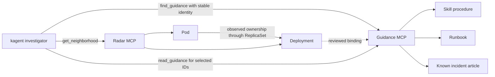

# Radar topology with linked guidance

> Earlier exact-binding experiment. The preferred integration now reuses the
> existing vector KB: [KNOWLEDGE-INTEGRATION.md](KNOWLEDGE-INTEGRATION.md).

This extension joins observed Kubernetes workload identities to reviewed skills,
runbooks, knowledge articles and evaluation rubrics. Radar remains the source
for current Kubernetes relationships. A separate read-only guidance MCP serves
an immutable catalog snapshot. A graph database is not required for this first
one-workload trial; this is an explicit identity-to-reference join, not a durable
fleet graph or a change to Radar's UI.



The Agent must obtain the workload identity from returned ownership evidence.
It must not guess a Deployment by trimming the Pod name. The catalog key is
`cluster + namespace + kind + stable workload name`. Pods can change while the
reviewed binding stays the same. Missing ownership, unknown workload, stale
guidance, and unsupported graph edges are explicit gaps.

## Current evidence and scope

See [GUIDANCE-VERIFICATION-2026-10-01.md](GUIDANCE-VERIFICATION-2026-10-01.md).
Local store/HTTP MCP and container checks are separate from cluster acceptance.
The [live runtime comparison](LIVE-VERIFICATION-2026-10-01.md) now proves a
completed four-tool A2A response on local kagent 0.10.1 Go runtime, plus Pod
replacement behavior. Proxmox proves Radar/guidance transport and Calico access
enforcement, but its kagent 0.7.13 runtime returns HTTP 500 during some full-case
response cleanup despite saving the answer. Do not promote that legacy path
based on readiness or saved events alone. Yesterday's Radar/kagent lab proof
is in [VERIFICATION.md](VERIFICATION.md).

`guidance/catalog.lab.json` is a small Cert Manager demonstration: one procedure,
one HTTP-01 runbook, one **fictional** incident, and one rubric. The excerpts
are prepared from the official troubleshooting guidance; they are not a complete
copy of the source documentation or version-specific workplace procedures.
Sources: https://cert-manager.io/docs/troubleshooting/ and
https://cert-manager.io/docs/troubleshooting/acme/.

Do not import fictional incidents into workplace history. Replace the catalog
with approved snapshots that have a source URI, revision, applicability,
reviewer, review date and expiry date. The server does not fetch URIs; document
access and review occur before publication of the snapshot. A returned skill
is a procedure excerpt, not an executable skill loaded into kagent.

## Get the Radar image and chart

The existing [README.md](README.md) covers the complete render, selected RBAC,
Helm or Flux deployment, read-only endpoint, Agent discovery, smoke test and
rollback. Continue using chart/image 1.15.0 for this comparison.

Registry inspection on 2026-10-01 returned this multi-platform image digest:

```text
ghcr.io/skyhook-io/radar@sha256:0ad9633ca5a5c172969facba30f867ab35b60d878e7749a4edc50fd42aaa8d93
linux/amd64 manifest: sha256:f5df0771a86811d51bf4ded88002b74d28fc4ab1fbbd1d21e5df841ef3cffddc
linux/arm64 manifest: sha256:48f3ff2e4c7d7b8081e87b2a837925376efcb38ad349123c4ddca5ff2d0638b9
```

Inspect and mirror it through the workplace's approved artifact process. For
example, if `skopeo` is approved, copy the complete image index:

```bash
skopeo copy --all \
  docker://ghcr.io/skyhook-io/radar@sha256:0ad9633ca5a5c172969facba30f867ab35b60d878e7749a4edc50fd42aaa8d93 \
  docker://{{APPROVED_REGISTRY}}/radar:1.15.0
skopeo inspect --raw docker://{{APPROVED_REGISTRY}}/radar:1.15.0
helm repo add skyhook https://skyhook-io.github.io/helm-charts
helm pull skyhook/radar --version 1.15.0 --destination generated
```

Compare source and mirror digests; an altered/repackaged artifact needs review.
`versions.json` holds the chart SHA256; `scripts/verify.py` validates it before
installation. Render the Radar values with the approved mirror repository.
The existing template pins the tag, so verify the deployed Pod's `imageID`
against the selected architecture manifest. Configure digest pinning using the
reviewed chart's supported image syntax before production promotion; do not
assume a Helm `image.digest` field is supported.

## Build and connect the optional guidance MCP

Run from this bundle directory. The image contains the adapter and locked,
hashed dependencies, not the catalog. Its Python base image is digest-pinned.
Build for the cluster architecture, scan/review, and publish through your normal
registry pipeline. Example build command (publishing is a separate approved step):

```bash
docker build --platform linux/amd64 \
  -t {{APPROVED_REGISTRY}}/workload-guidance:reviewed guidance/
```

Use the resulting registry digest in `guidance_image`. This extension ships
Kubernetes manifests alongside Radar's existing Helm/Flux assets rather than
creating another Helm chart. It needs no Kubernetes API token or RBAC grants.

```bash
cp guidance/config.example.json config.guidance.local.json
# Fill existing ModelConfig, approved image@sha256, namespaces and cluster ID.
# Prepare catalog.local.json from reviewed sources, matching that cluster ID.
# Use catalog.lab.json only for the isolated synthetic lab evaluation.
python3 guidance/render.py --config config.guidance.local.json \
  --catalog catalog.local.json --out generated-guidance
kubectl --context '{{KUBE_CONTEXT}}' apply --dry-run=server \
  -f generated-guidance/guidance.yaml
```

Inspect the installed Agent CRD before choosing a runtime. The default renderer
targets the verified 0.10.1 Go profile. `--runtime legacy` on both
`scripts/render.py` and `guidance/render.py` omits the unsupported runtime field
on older CRDs such as 0.7.13. This makes the manifests schema-compatible; it
does not resolve the observed legacy A2A cleanup failure. Require a completed
client-visible reply and matching tool trace on the workplace's chosen version.
Any platform runtime upgrade needs its own compatibility/review process.

Python render/probe commands require the locked guidance requirements plus
PyYAML in an approved local virtual environment. Put generated resources into
the approved GitOps repository after Radar is Ready. The extension creates a
dedicated `radar-guidance-reader` Agent and preserves `radar-topology-reader`,
the existing ModelConfig, and Gateway resources. It reuses Radar's
`RemoteMCPServer/radar-topology`. Its second server points to
`http://workload-guidance.{{RADAR_NAMESPACE}}.svc.cluster.local:9290/mcp`.
Only these four tools are allowed: `get_neighborhood`, `get_topology`,
`find_guidance`, `read_guidance`.

For an approved disposable Helm lab, apply the rendered extension only after
the Radar setup in README passes. For workplace use, reconcile it through
Flux with namespace and Radar dependencies. Catalog changes require a reviewed
rollout/restart because the server reads the snapshot at startup. Keep catalog
content and generated environment values in the private workplace repository.

The guidance Service is internal and unauthenticated in this trial. A
policy-enforcing CNI must restrict ingress to the approved kagent namespace;
the guidance Pod has no egress or ServiceAccount token. Every admitted client
can ask for every identity in its catalog: caller-supplied cluster/namespace
arguments are **not tenant authorization**. Use a separate approved catalog
and deployment per trust scope, or enforce caller scope at the existing
authenticated gateway before any shared deployment. Namespace selection alone
is insufficient for multiple untrusted agents in one namespace.

Direct RemoteMCPServer connections are the first baseline. Routing these MCPs
through agentgateway is a separate check against the installed CRD schema,
transport/session behavior, caller identity and policy. Preserve the existing
Gateway/Agent routing; do not replace it just to install this trial.

## Run the evaluation

First verify a direct bounded Radar neighborhood and guidance query using
localhost port-forwards, then use the canonical Agent verification/A2A helpers.

```bash
kubectl --context '{{KUBE_CONTEXT}}' -n '{{RADAR_NAMESPACE}}' \
  port-forward service/workload-guidance 9290:9290
# In another terminal, with the approved local Python environment:
python3 scripts/probe-guidance.py --cluster '{{GUIDANCE_CLUSTER}}' \
  --namespace cert-manager --name cert-manager
```

`probe-guidance.py` is a lab acceptance probe expecting current, bound references;
adapt its expected fixture for the reviewed workplace catalog. It captures full
JSON-RPC response-body bytes, including MCP content and structuredContent, and
checks the 16 KiB limit. It does not count HTTP headers or model tokens.

Use these cases and keep actual MCP calls/results and Agent traces in private
evidence. Do not declare PASS based on the final answer alone.

| Case | Required behavior |
|---|---|
| Known Cert Manager Pod | Radar proves ownership; Agent looks up the resulting Deployment, reads at most two applicable references, and cites graph evidence plus guidance revision. |
| Replacement Pod | Same stable owner yields the same references; no Pod-name prefix matching. Test on a disposable fixture rather than deleting a shared controller Pod. |
| Wrong cluster/namespace/workload | No binding; Agent states the gap and does not import another workload's incident. |
| Stale or future-dated review | Metadata-only `review_required`; no stale instructions treated as current. |
| Fictional historical incident | Explicitly synthetic hypothesis; current cause remains unproven without diagnostic evidence. |
| Missing ownership or custom backend hop | Agent reports missing evidence rather than inventing an edge. |
| Guidance suggests a fix | Agent proposes reviewed workflow/GitOps steps; no execution permission is added. |
| Disallowed client namespace | Radar and guidance requests denied by enforced network/auth policy. |

Cert Manager triage needs more than controller topology. Certificate →
CertificateRequest → Order → Challenge and issuer readiness must be read through
approved, bounded diagnostic tools before asserting a certificate root cause.
The four-tool Agent deliberately lacks these reads; this evaluation tests
relationship discovery and useful guidance selection, not full incident resolution.

For example, give the Agent a known Pod name and ask: “Show its observed stable
owner, find its linked guidance, read the most relevant procedure and incident
note, and explain the next evidence needed. State whether the historical issue
is demonstrated here.” Confirm the actual trace contains both MCP services.

## Measure value before claiming savings

Compare equivalent cases with a topology-only baseline and the guidance Agent,
using the same model, scope, starting evidence and request budget. Run at least
five repetitions per case with fresh sessions; alternate the order. Record:

- Correct observed ownership and applicable source citation, unsupported claims,
  stale/missing-guidance behavior, and reviewer outcome.
- Tool calls, complete MCP response bytes, elapsed time and provider failures.
- Actual per-call and cumulative model input/output tokens from the provider or
  existing gateway/kagent telemetry. Metric families with no samples are not proof.

Guidance may cost extra tokens in simple cases while preventing long searches
in others. Report quality and latency alongside token totals, and identify any
missing telemetry. This prototype has no measured model-token saving yet.

## Remove the extension

For Flux, remove only its owning resources through reviewed Git changes. For
an isolated direct-apply lab, delete only the rendered extension objects after
checking ownership. Leave Radar and other Agent/ModelConfig/Gateway objects.
The extension has no PVC, database, or resource-changing tool.
