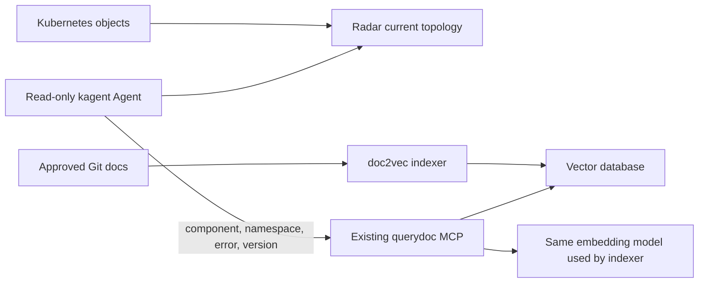

# Radar plus the existing documentation knowledge base

Preferred architecture: Radar identifies Kubernetes relationships; the existing
upstream doc2vec/querydoc service retrieves relevant documentation. Reuse the
workplace KB, embedding provider, RemoteMCPServer and delivery flow. No bespoke
guidance MCP or workload-to-document catalog is required.



## Small workplace delta

1. Install Radar using the chart/image, RBAC and Flux/Helm instructions in
   [README.md](README.md). Keep its read-only MCP endpoint.
2. Identify the accepted existing querydoc RemoteMCPServer and its actual tool
   schema. This repo's reusable integration is
   `ai-platform/kagent-knowledge-base/`; do not blindly apply its older Agent
   promptTemplate or create replacement model credentials. kagent 0.10 removed
   the bundled querydoc/doc2vec chart: it is deployed separately.
3. If no KB exists, use that integration's existing indexer, database PVC and
   querydoc manifests. Mirror/pin `ghcr.io/kagent-dev/doc2vec/mcp:2.11.0` (lab OCI
   index digest `sha256:a67a75528544767a76f35f2a24b7ca8e2d8c592e8e6362f2d18132b772742425`).
   Use the same embedding model and dimension at indexing and query time.
   Suspend scheduled ingestion until the corpus/provider are reviewed.
4. Fill `knowledge/config.example.json` with existing object names and corpus
   selectors. Render only the separate read-only Agent:

   ```bash
   python3 knowledge/render.py --config /path/outside/git/config.json > /path/outside/git/agent.yaml
   kubectl --context {{APPROVED_CONTEXT}} apply --dry-run=server -f /path/outside/git/agent.yaml
   ```

   Deliver the reviewed Agent through existing GitOps. `--runtime legacy`
   omits the runtime field for old CRDs; this does not fix the previously
   observed Proxmox 0.7.13 A2A response failure. Go runtime 0.10.1 is the tested path.
5. Verify with the shared `scripts/kagent-verify-agent.sh` and
   `scripts/kagent-a2a-invoke.sh` from the repo root. Require completed A2A
   answers and persisted tool traces, not readiness alone.

## Retrieval contract

A Pod query follows observed ownership to a stable workload. The Agent searches
once with component/workload, namespace, reported error and known version,
requesting at most two snippets. Namespace is a search hint, not authorization.
The verified querydoc tool supports product/version selectors; it has no native
namespace metadata filter. `urlPathPrefix` in the reviewed upstream source is a
post-filter that may miss applicable results beyond its candidate window.
Check the installed schema before using it. Do not treat path filters as ACLs.

Put document identity, component, namespace applicability, software versions,
review date, expiry and source in the document text so applicable chunks retain
that context. Generic component guidance can span namespaces; a namespace-bound
incident cannot be silently applied elsewhere. Historical incidents propose
hypotheses that still need current diagnostic evidence. A retrieved procedure
is documentation, not an automatically loaded executable skill.

Vector nearest neighbors are not an applicability verdict. querydoc 2.11.0 has
no rejection threshold and calls returned snippets "relevant". The prompt
requires an independent scope check and `NO_RELEVANT_DOCS` when inappropriate.
Expired guidance must be withheld from recommendations. For a strong enforcement
boundary, enforce approvals/expiry during corpus publication and access through
the existing KB service. Prompt instructions do not enforce security or byte limits.

`limit=2` is an Agent instruction; the upstream schema does not impose a hard
maximum. This integration does not claim the custom prototype's enforced 16 KiB
ceiling. Measure full client-visible MCP envelopes and model telemetry. Do not
expose `fetch_document` or bulk tools to this Agent.

## Lab corpus and evidence

The local evaluation indexes a snapshot of `docs/platform-kb` from kagent-public
plus [one labelled Cert Manager lab fixture](knowledge/corpus/cert-manager-http01.md).
The fixture is copied to `runbooks/cert-manager-http01.md` in the build snapshot;
its retrieval URI is `docs/platform-kb/runbooks/cert-manager-http01.md`.
It is not a record of a real workplace incident. The Kubernetes fixture is a
pause Deployment, not an actual Cert Manager installation.

The lab uses a temporary OpenAI-compatible embedding endpoint on the Mac with
all-MiniLM-L6-v2 (384 dimensions), revision
`1110a243fdf4706b3f48f1d95db1a4f5529b4d41`. It is an embedding provider, not a new
Agent tool. Production should use the workplace's approved endpoint. This small
model truncates long inputs; it is not a production retrieval-quality benchmark.
The local demo depends on this temporary endpoint remaining alive.

Read [the live KB receipt](KNOWLEDGE-VERIFICATION-2026-10-01.md) for measured
results and limitations. Raw cluster/model responses remain outside public Git.
For the lab corpus, use `knowledge/probe.py --url {{QUERYDOC_URL}} --output /path/outside/git/probe.json`
with the existing MCP Python SDK environment to record full MCP response body bytes, including SSE framing where present.
HTTP transport headers are excluded. Replace the lab cases with approved workplace
questions and expected sources for workplace acceptance.

## Previous prototype and rollback

The `guidance/` server and its receipts are an earlier exact-binding experiment,
not the target architecture. This KB Agent references only Radar and querydoc.
Roll back the additive Agent by deleting `Agent/radar-knowledge-reader`; preserve
existing Radar, KB, models, credentials and GitOps objects. Remove any separately
created lab-only querydoc resources when ending the demo. No cluster upgrade or
production deployment is part of this evaluation.

## Official sources

- https://github.com/kagent-dev/doc2vec/tree/v2.11.0
- https://www.kagent.dev/docs/kagent/0.x/resources/release-notes/
- https://cert-manager.io/docs/troubleshooting/acme/
- https://huggingface.co/sentence-transformers/all-MiniLM-L6-v2
