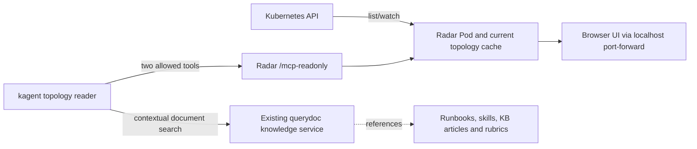

# Radar topology MCP — workplace trial bundle

For the workplace OCI snapshot registry, start with
[AIRGAPPED-OCI-HANDOFF.md](AIRGAPPED-OCI-HANDOFF.md).

Install the open-source Radar collector and browser UI inside one Kubernetes
cluster, then give a kagent Agent bounded, read-only relationship queries.
This is a starting point for workplace review and installation, not a production
certification or a completed shared knowledge graph.

The preferred knowledge integration reuses the existing doc2vec/querydoc KB.
See [KNOWLEDGE-INTEGRATION.md](KNOWLEDGE-INTEGRATION.md) for the small Agent
delta and [live KB evidence](KNOWLEDGE-VERIFICATION-2026-10-01.md). The earlier
[custom guidance prototype](GUIDANCE-INTEGRATION.md) remains as experimental
reference; it is not the target architecture.

**Pinned:** Radar chart/image 1.15.0. The lab used kagent 0.10.1, v1alpha2
`RemoteMCPServer`/`Agent`, and the Go runtime. Use the workplace's existing
ModelConfig and model delivery path. Review the installed CRD schema if your
kagent version differs. There is no LLM credential or new model configuration
in this bundle.



## Work-agent TLDR: air-gapped OCI installation

1. Import Radar image `ghcr.io/skyhook-io/radar:1.15.0` and Helm package
   `radar-1.15.0.tgz` into the workplace's internal OCI snapshot registry.
   Use the verified checksums/digests and import commands in
   [AIRGAPPED-OCI-HANDOFF.md](AIRGAPPED-OCI-HANDOFF.md). The Helm artifact is a
   `.tgz` package; importing the chart does not import its container image.
2. Set `image_repository` to the internal Radar image repository. Render the
   bundle configuration, and deliver its namespace, selected read-only RBAC,
   ServiceAccount and NetworkPolicy through the existing workplace flow.
   Install Radar 1.15.0 from the internal `oci://` chart reference with the
   generated values. Chart-created RBAC and ServiceAccount are disabled, so
   the bundle's prerequisites must be present first.
3. Reuse the workplace's kagent, accepted ModelConfig and vector KB. Register
   Radar's internal `/mcp-readonly` endpoint and render `knowledge/agent.yaml.tmpl`
   using `knowledge/render.py`. The knowledge Agent exposes only
   `get_neighborhood` and the existing querydoc `query_documentation` tool.
4. If querydoc is absent, mirror `ghcr.io/kagent-dev/doc2vec/mcp:2.11.0` and
   adapt the existing KB deployment pattern. Use an approved internal embedding
   endpoint and the same model/dimension for indexing and queries. Any local
   embedding server also needs its model/tokenizer/config assets imported.
5. Use an internal indexing pipeline or prebuilt doc2vec indexer. The example
   CronJob downloads public GitHub source and npm packages; mirroring
   `node:20-bookworm` alone does not make it work offline. The stock Flux
   template also references a public Helm repository: replace it with the
   existing internal OCI delivery pattern. Keep indexing suspended until tested.
6. Publish approved, current workplace documents with component, stable workload,
   namespace applicability, version, source, revision and review dates. Exclude
   expired/unapproved content before retrieval. Replace the synthetic lab runbook.
7. Verify installed CRD/runtime compatibility, read-only permission denials,
   actual MCP queries and completed A2A replies. Repeat relevant, unrelated,
   wrong-scope, expiry and replacement-Pod cases. Confirm Radar's response arrives
   before the KB search, and record citations, latency and cumulative token usage.

**Before acceptance:** prompt-only expiry handling is partial; the agent can
repeat expired diagnostic content. Close this through corpus publication.
Token savings and successful remediation still require workplace comparisons.
The tested runtime is kagent 0.10.1 Go; preserve the workplace's approved version
and validate it rather than assuming compatibility or upgrading automatically.

Direct chart download for the connected import machine:
https://github.com/skyhook-io/helm-charts/releases/download/radar-1.15.0/radar-1.15.0.tgz

Full OCI commands, artifact inventory, digests and offline prerequisites:
[AIRGAPPED-OCI-HANDOFF.md](AIRGAPPED-OCI-HANDOFF.md).

## What is proven and what remains

The earlier [lab evaluation](https://github.com/davidmarkgardiner/kagent-public/blob/6ea619c2/work-agent-bundles/kubernetes-topology-poc/RADAR-EVALUATION.md) verified
Radar deployment, browser navigation, informer updates, a direct bounded MCP
neighborhood result, kagent discovery, and Agent readiness. A conversational
A2A test hit the upstream model quota before tool use. This bundle's narrowed
RBAC profile must pass its workplace checks before being relied on.

The later [live KB evaluation](KNOWLEDGE-VERIFICATION-2026-10-01.md) completed
real A2A calls on kagent 0.10.1 Go. It verified topology-informed document search,
citations, unrelated/wrong-scope rejection and stable lookup after Pod replacement.
Expiry handling remains partial. The old model-quota result above describes the
initial evaluation, not the final local integration status.

Radar maintains current topology in an in-memory cache. Its optional PostgreSQL
storage is for the event timeline. It does not supply a durable fleet-wide graph
of runbooks, skills, and knowledge articles. The chart is designed for one replica.
Start with one approved development cluster; fleet aggregation and availability
are later decisions.

The lab found a missing `HTTPRoute → AgentgatewayBackend → Service` hop. Radar
displayed Gateway → HTTPRoute but did not show the custom backend connection.
Istio kinds have read grants here, but Istio topology behavior was not tested
in the lab. Service names do not prove DNS resolution or observed traffic.

## Files

| File | Purpose |
|---|---|
| `config.example.json` | Non-secret namespace, ModelConfig name, and image repository inputs. |
| `versions.json` | Reviewed chart version, archive checksum, image version, and lab versions. |
| `templates/values.yaml.tmpl` | One Pod, internal Service, no cloud reporting, no ingress, no chart-generated RBAC. |
| `templates/namespace.yaml.tmpl` | Dedicated namespace with restricted Pod Security. |
| `templates/inventory-access.yaml.tmpl` | Dedicated ServiceAccount and selected resource reads. No Secret, log, exec, port-forward, or resource mutation grants. |
| `templates/network-policy.yaml.tmpl` | Allows port 9280 from the chosen kagent namespace. |
| `templates/kagent-agent.yaml.tmpl` | `/mcp-readonly` discovery and a separate Agent with two topology tools. |
| `templates/flux-helm.yaml.tmpl` | Pinned HelmRepository/HelmRelease for the permanent GitOps path. |
| `scripts/render.py` | Resolves inputs, rejects unresolved placeholders, writes installable YAML. |
| `scripts/verify.py` | Checks the chart checksum, permission boundaries, Agent tools, and Flux values. |
| `scripts/probe-mcp.py` | Reads the tool catalog and makes one capped neighborhood query. |
| `scripts/shared/` | Exact snapshots of the repository's canonical Agent verification and A2A helpers, included so the copied folder works by itself. |
| `AIRGAPPED-OCI-HANDOFF.md` | Internal OCI snapshot import/install commands, image inventory, digests and air-gap dependency requirements. |
| `KNOWLEDGE-INTEGRATION.md` | Reuse existing doc2vec/querydoc, configure retrieval and preserve workplace wiring. |
| `KNOWLEDGE-VERIFICATION-2026-10-01.md` | Live A2A/tool-trace results, token measurements and remaining limitations. |
| `knowledge/agent.yaml.tmpl`, `knowledge/render.py` | Separate Radar + existing querydoc Agent and configuration renderer. |
| `knowledge/probe.py`, `knowledge/summarize-trace.py` | Real MCP response-body measurement and model usage/tool-order extraction. |
| `knowledge/corpus/`, `knowledge/local-embeddings-lab.py` | Synthetic runbook and lab-only embedding reproducibility assets. |
| `guidance/`, `GUIDANCE-INTEGRATION.md` | Earlier custom exact-binding prototype, retained as experimental reference. |

## 1. Prepare the workplace inputs

Tools: `helm`, `kubectl`, Bash, `curl`, `jq`, Python 3.9+, and PyYAML for local
verification. The canonical repository verification/A2A helpers are included
unchanged under `scripts/shared/`; `versions.json` checks their hashes. Make
future helper changes in the source repository's `scripts/` first, then refresh
these copies and their hashes. You can copy this entire bundle folder into the
approved workplace checkout without copying the rest of the public repository.

```bash
cd work-agent-bundles/radar-topology-mcp
cp config.example.json config.local.json
# Edit config.local.json: set model_config to an existing accepted ModelConfig.
python3 scripts/render.py --config config.local.json --out generated
```

Configuration keys:

| Key | Meaning |
|---|---|
| `radar_namespace` | A dedicated namespace; default `radar-topology`. It must differ from existing workload namespaces. |
| `kagent_namespace` | Namespace of the new Agent and the existing ModelConfig; default `kagent`. |
| `model_config` | Name of the workplace's existing accepted kagent ModelConfig. |
| `image_repository` | Official Radar repository, or an approved internal mirror containing the exact 1.15.0 image. No tag in this field. |

The only unresolved shipped config value is `{{EXISTING_KAGENT_MODEL_CONFIG}}`.
Commands below also require `{{KUBE_CONTEXT}}` and `{{SERVICE_NAME}}` to be
replaced. Knowledge catalog placeholders identify approved cluster/workload
names, source URIs, and reviewed revisions; they are deliberately not rendered
or automatically loaded.

`config.local.json`, `generated/`, and `evidence/` are ignored. Keep actual
workplace names, topology responses, credentials, and receipts out of this
public repository. Kubernetes reads include ConfigMaps and workload specs;
confirm the approved namespace/data scope before attaching a model-backed Agent.
For a namespace-only trial, have the data owner replace the cluster-wide Role
with the approved namespaced Roles and accept the reduced topology coverage.

## 2. Render and inspect before installation

Run from this bundle directory. Set the namespace variables to the values used
in `config.local.json` and select the context explicitly.

```bash
RADAR_KUBE_CONTEXT='{{KUBE_CONTEXT}}'
RADAR_NAMESPACE='radar-topology'
RADAR_KAGENT_NAMESPACE='kagent'
helm repo add skyhook https://skyhook-io.github.io/helm-charts
helm repo update skyhook
helm pull skyhook/radar --version 1.15.0 --destination generated
helm template radar-topology generated/radar-1.15.0.tgz \
  --namespace "$RADAR_NAMESPACE" -f generated/values.yaml \
  > generated/helm-rendered.yaml
# Install requirements.txt in your approved Python environment if needed.
python3 scripts/verify.py --out generated \
  --helm-manifest generated/helm-rendered.yaml \
  --chart generated/radar-1.15.0.tgz
kubectl --context "$RADAR_KUBE_CONTEXT" explain remotemcpserver.spec
kubectl --context "$RADAR_KUBE_CONTEXT" explain agent.spec.declarative
```

The chart checksum must match `versions.json`. If your artifact mirror
repackages the chart, review and record its provenance/checksum through your
normal process before using it. Pinning a tag does not verify a mirror's image
contents; preserve the approved image digest when mirroring.

## 3. Install through the chosen delivery path

For permanent installation, put rendered `namespace.yaml`, `inventory-access.yaml`,
`network-policy.yaml`, and `flux-helm.yaml` in the workplace's approved Flux
repository. Reconcile namespace/access first, then the HelmRelease. Deliver
`kagent-agent.yaml` after Radar is Ready and the workplace CRDs are validated.
Use the platform's existing Kustomization dependencies and review flow.
Do not run a separate Helm upgrade against a Flux-owned release.

For an initial approved development-cluster trial using Helm:

```bash
kubectl --context "$RADAR_KUBE_CONTEXT" apply --dry-run=server \
  -f generated/namespace.yaml
kubectl --context "$RADAR_KUBE_CONTEXT" apply -f generated/namespace.yaml
kubectl --context "$RADAR_KUBE_CONTEXT" apply --dry-run=server \
  -f generated/inventory-access.yaml
kubectl --context "$RADAR_KUBE_CONTEXT" apply -f generated/inventory-access.yaml
kubectl --context "$RADAR_KUBE_CONTEXT" apply --dry-run=server \
  -f generated/network-policy.yaml
kubectl --context "$RADAR_KUBE_CONTEXT" apply -f generated/network-policy.yaml
kubectl --context "$RADAR_KUBE_CONTEXT" -n "$RADAR_NAMESPACE" apply \
  --dry-run=server -f generated/helm-rendered.yaml
helm --kube-context "$RADAR_KUBE_CONTEXT" upgrade --install radar-topology \
  generated/radar-1.15.0.tgz --namespace "$RADAR_NAMESPACE" \
  -f generated/values.yaml --wait --timeout 180s
kubectl --context "$RADAR_KUBE_CONTEXT" apply --dry-run=server \
  -f generated/kagent-agent.yaml
kubectl --context "$RADAR_KUBE_CONTEXT" apply -f generated/kagent-agent.yaml
```

This profile uses an unauthenticated **internal** Service with ingress restricted
to the selected kagent namespace by NetworkPolicy. That requires a CNI that
enforces NetworkPolicy; plain kind does not prove enforcement. It permits all
Pods in that namespace, so use a dedicated trusted namespace or narrow the
Pod selectors after inspecting your controller/runtime labels. The UI is for
localhost port-forward access. Shared UI/remote MCP exposure requires your
existing authenticated gateway, tenant scope, and TLS policy first. Do not
publish this no-auth Service through an Ingress or external LoadBalancer.

## 4. Verify the live installation

```bash
kubectl --context "$RADAR_KUBE_CONTEXT" -n "$RADAR_NAMESPACE" \
  rollout status deployment/radar-topology --timeout=120s
kubectl --context "$RADAR_KUBE_CONTEXT" auth can-i list pods --all-namespaces \
  --as="system:serviceaccount:$RADAR_NAMESPACE:radar-topology"
kubectl --context "$RADAR_KUBE_CONTEXT" auth can-i patch deployments \
  -n "$RADAR_NAMESPACE" --as="system:serviceaccount:$RADAR_NAMESPACE:radar-topology"
kubectl --context "$RADAR_KUBE_CONTEXT" auth can-i get secrets --all-namespaces \
  --as="system:serviceaccount:$RADAR_NAMESPACE:radar-topology"
```

Expected answers: `yes`, `no`, `no`. `can-i` requires permission to impersonate
the ServiceAccount; ask the platform owner to run these if your identity lacks
that permission. A denied impersonation is not a read-only proof.

In a separate terminal, keep this running:

```bash
kubectl --context "$RADAR_KUBE_CONTEXT" -n "$RADAR_NAMESPACE" \
  port-forward service/radar-topology 19280:9280
```

Open http://127.0.0.1:19280/ and click through a namespace and a known Service.
Then make one MCP query against a Service with a known backing workload:

```bash
python3 scripts/probe-mcp.py --namespace "$RADAR_NAMESPACE" --name radar-topology
kubectl --context "$RADAR_KUBE_CONTEXT" -n "$RADAR_KAGENT_NAMESPACE" \
  get remotemcpserver radar-topology -o jsonpath='{.status.conditions}'
kubectl --context "$RADAR_KUBE_CONTEXT" -n "$RADAR_KAGENT_NAMESPACE" \
  get remotemcpserver radar-topology -o jsonpath='{.status.discoveredTools[*].name}'
# From this bundle directory, use the bundled canonical shared helpers:
bash scripts/shared/kagent-verify-agent.sh --context "$RADAR_KUBE_CONTEXT" \
  --ns "$RADAR_KAGENT_NAMESPACE" --controller-ns "$RADAR_KAGENT_NAMESPACE" \
  --agent radar-topology-reader
bash scripts/shared/kagent-a2a-invoke.sh --context "$RADAR_KUBE_CONTEXT" \
  --ns "$RADAR_KAGENT_NAMESPACE" --controller-ns "$RADAR_KAGENT_NAMESPACE" \
  --agent radar-topology-reader --timeout 90 \
  --text 'Use get_neighborhood to show what connects to Service radar-topology in namespace radar-topology. Cite its returned relationship and explain whether it proves live traffic.'
```

Adjust the smoke prompt if the configured Radar namespace differs. Accepted,
Ready, and a nonempty assistant reply are separate gates. Inspect the runtime
tool trace to confirm `get_neighborhood` was actually called; the answer must
agree with the direct probe. Model quota/provider failures do not prove or
disprove MCP tool behavior. Do not declare the Agent integration passed until
one real tool call and evidence-based response complete.

## 5. Connect workplace guidance in the next phase

The supplied Agent can interrogate topology and propose a bounded next step.
It has an embedded investigation procedure and a short review rubric. Files
under `knowledge/` are a proposed packaging and lookup contract, not an installed
knowledge backend, mounted runtime skill, or automatic evaluator.

Map guidance to `cluster + namespace + kind + stable workload name`, rather
than a transient Pod name. Keep approved runbooks, skills, KB articles, and
rubrics in your current Git/document service. Add fixed, bounded knowledge tools
such as `find_guidance` and `read_guidance` through a separate approved MCP
server; then add only those verified tool names to the Agent. Include source
revision, applicability, access scope, and missing/stale-reference behavior.
No generic SQL, Cypher, filesystem read, or arbitrary URL-fetch tool is needed.

Acceptance example: the Agent finds the Service's workload through Radar,
retrieves the approved runbook for that stable identity, cites both sources,
applies the rubric, and proposes a change with rollback and verification.
Resource-changing permissions stay on approved workflow/GitOps identities.

## Rollback

For a Helm trial, delete only the dedicated objects created by this bundle:

```bash
kubectl --context "$RADAR_KUBE_CONTEXT" delete -f generated/kagent-agent.yaml
helm --kube-context "$RADAR_KUBE_CONTEXT" -n "$RADAR_NAMESPACE" uninstall radar-topology
kubectl --context "$RADAR_KUBE_CONTEXT" delete -f generated/network-policy.yaml
```

Remove the dedicated ClusterRoleBinding, ClusterRole, and ServiceAccount from
`inventory-access.yaml` after confirming no remaining consumers. Preserve the
namespace if it contains anything else. For Flux, remove/suspend the owning
resources through Git and wait for reconciliation; do not delete objects while
Flux is still recreating them. This profile stores no persistent timeline/PVC.

Sources: https://github.com/skyhook-io/radar,
https://github.com/skyhook-io/radar/blob/main/docs/mcp.md,
https://github.com/skyhook-io/radar/blob/main/docs/in-cluster.md,
https://headlamp.dev/docs/latest/learn/mcp-support/.
